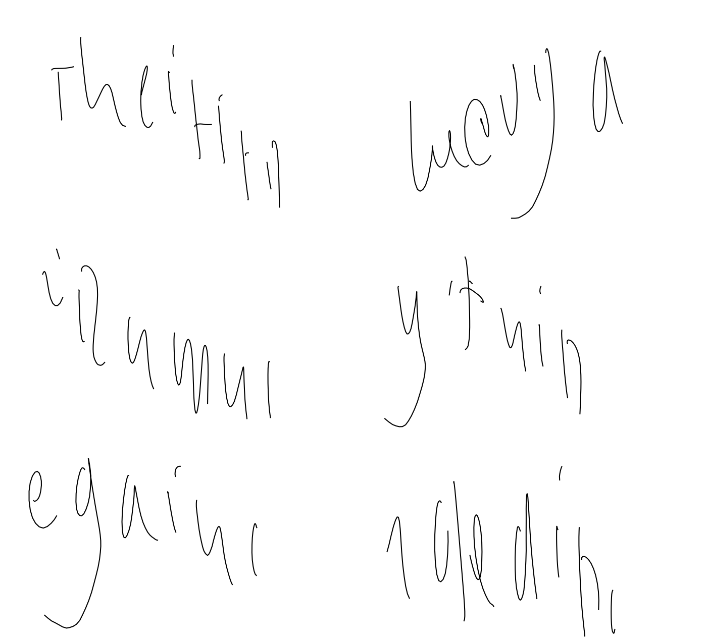

# handwriter

This repo contains implementation of deep recurrent network trained to generat human-like handwriting. 

The idea is heavily based on [1], but some things were simplified:
1. Network predicted exact (x, y) coordinates of next point and probability of stroke, thus having the output dimension 3.

2. L2 loss is used instead of mixed density loss, because of greater numerical stability and faster calculation.

3. Network was trained only on subset of available data and had 2(instead of 3) LSTM layers.

The model was trained on [2] using a subset of randomly drawn 8k samples as train dataset. The training was conducted using truncated backpropagation(named "tensorflow style" in [3]) in order to save memory. Random noise was added to training data to make network more stable at inference stage. The implementation code was implemented in Tensorflow [4].

Final model has around ... parameters. Considering its limitation in comparison with model from [1], it still has provided some interesting results. The trained model demonstrated ability to generate letter, sometimes even placing them in sensible order. Below are 6 sequences of length 200, generated after model had seen sequences from training data of length 50(not shown).

