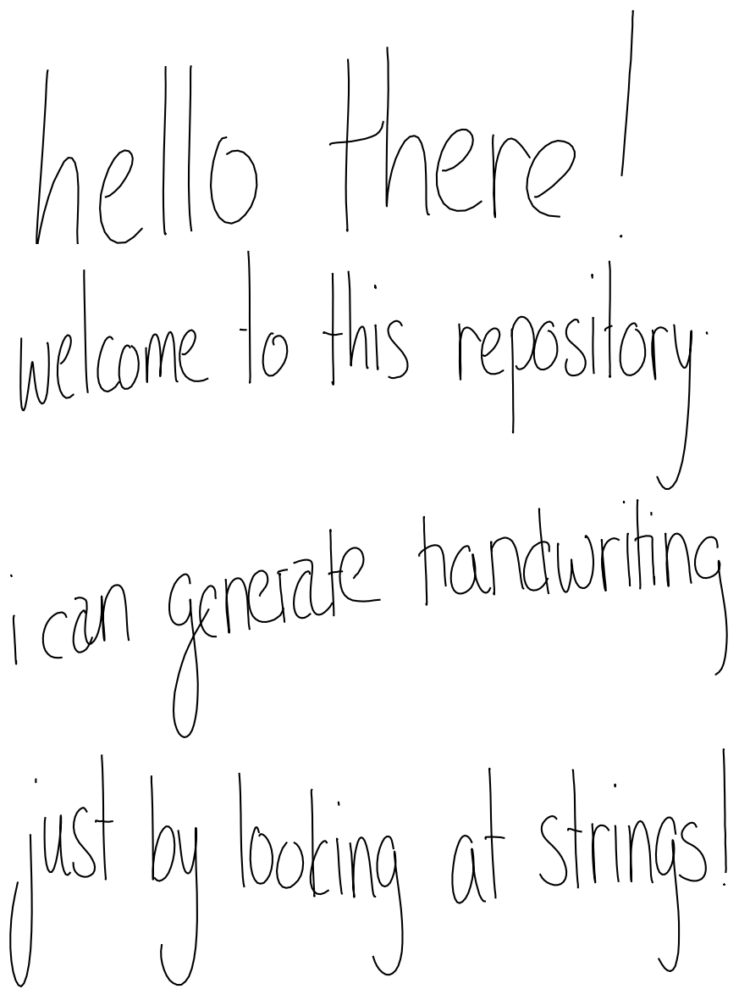
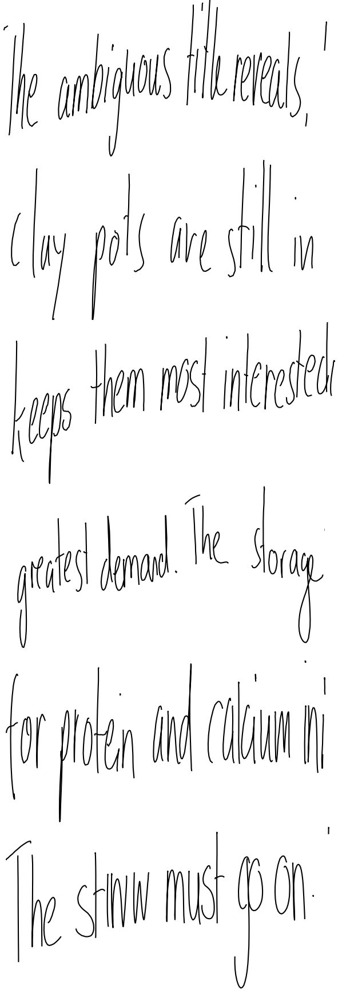

# handwriter

This repo contains implementation of a deep recurrent network trained to generate human-like handwriting. 

It is based on "Generating Sequences With Recurrent Neural Networks"[1](#references) by Alex Graves.

## How does it work

When writing, pen movement can be described by recording its coordinates on drawing board, e.g. every t milliseconds. The network is then trained to predict the coordinates (x, y) of the next point relative to current point, given what it predicted so far and one-hot encoded sentences, it is trying to write. Network does it by using attention mechanism on one-hot encoded sentences and predicting the distribution(which is a 2D Gaussian mixture) of offset coordinates (x, y) for the next point. The point coordinates can be then sampled from this distribution and fed to the network in order to continue handwriting generation. More details on network architecture can be found in original article[1](#references).

The network was trained on online handwriting dataset[2](#references) using Adam[3](#references)(in article[1](#references) RMSprop was used). Network and training loop were implemented in python deep learning library - tensorflow[4](#references).

Final network had around 3.7M parameters and could produce good samples of very much human-like handwriting.

## Examples

Here are some examples of network outputs, generated at different smoothness parameters. The sentences come from test dataset and were not seen during training.

Smoothness reduces variance in (x, y)-coordinates, predicted by network. By setting it high one can get more stable and, well, smooth predictions. More details on it can be found in article[1](#references).

Although original article[1](#references) demonstrates readable samples generated with no(zero) smoothness, this implementation produces poor results when no smoothness is applied. So it is recommended to set smoothness at around 1.5 and generate several samples for one sentence in order to get good results quick - usually no more than 10 are needed to get a set with several well written examples.

The trained network is stored under [handwriting-synthesis/model/](./handwriting-synthesis/model/).

## References:

1. Graves A., "Generating Sequences With Recurrent Neural Networks", [https://arxiv.org/pdf/1308.0850.pdf](https://arxiv.org/pdf/1308.0850.pdf)

2. Liwicki M. and Bunke H., "IAM-onDB - an on-line English sentence database acquired from handwritten text on a whiteboard", [https://fki.tic.heia-fr.ch/databases/iam-on-line-handwriting-database](https://fki.tic.heia-fr.ch/databases/iam-on-line-handwriting-database)

3. Kingma D. and Ba J., "Adam: A Method For Stochastic Optimization" [https://arxiv.org/pdf/1412.6980](https://arxiv.org/pdf/1412.6980)

4. TensorFlow, [https://www.tensorflow.org](https://www.tensorflow.org)
